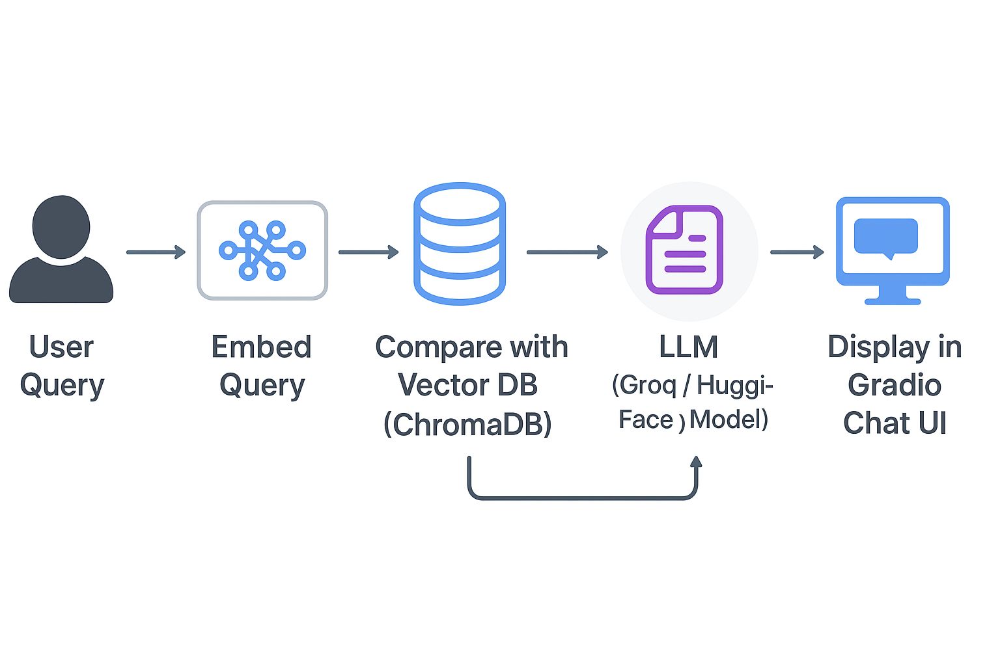
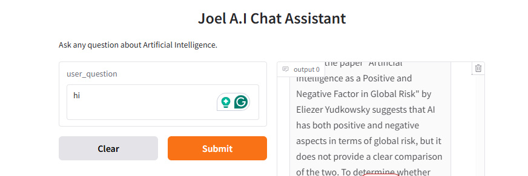

# 🤖 Developing a Chat Assistant Using Retrieval Augmented Generation (RAG)

## Overview
This project focuses on developing a personalized AI assistant utilizing Retrieval-Augmented Generation (RAG) techniques. The assistant leverages advanced machine learning models to provide insightful answers about artificial intelligence.
[](https://huggingface.co/spaces/Khafui/Joel_AI_chat)

---


## Purpose
The goal is to provide an intuitive way for users to interact with AI and gain insights on topics related to artificial intelligence.

---

## Tools and Technologies
This assistant uses:
- **Programming Language**: Python. The primary programming language used for the development
- **LLaMA**: A large language model for natural language understanding.
- **Chroma**: For vector database management to store and retrieve information efficiently.
- **Gradio**: To create a user-friendly web interface for interaction.
- **Libraries**: Hugging Face Transformers, PDF loaders, etc.

---

**Flow**
User Query → Embed + Search (ChromaDB) → Retrieve Context → LLM (Groq/HF) → Final Answer

---

## 🎨 Visual Overview

### High-Level RAG Flow


### Assistant in Action


---

## Features
- Conversational AI capabilities.
- Ability to answer questions related to artificial intelligence.
- User-friendly web interface.

---

## Key Insights
- **Enhanced User Interaction**: The assistant is designed to provide an intuitive interface for users to ask questions and receive detailed answers.
- **Efficient Information Retrieval**: By integrating a vector database, the assistant can quickly retrieve relevant information from multiple documents, improving response accuracy.
- **Scalable Architecture**: The modular design allows for easy integration of additional features, such as voice interaction and support for more topics.
- **User-Centric Design**: The chat interface is developed to facilitate easy communication, making it accessible for users of all technical backgrounds.

---

## Project Structure
```plaintext
│
├── .env.example          # Template for environment variables
├── config.py             # Configuration settings
├─  app.py                #converted project ipynb file to py (as main gradio entry poin)
├── notebook/             # Jupyter notebook for development
├─ images/                # images of live screenshots
├── document.zip/         # Source documents used for retrieval
├── LICENSE               # MIT license
├── requirements.txt      # contains libraries to run the project
└── README.md             # Overview of the Project
```

---

## Requirements
**The following libraries are necessary for this project**:

- transformers==4.24.0 # For using the LLaMA model
- torch==1.12.1 # For PyTorch operations
- gradio==3.0.7 # For the web interface
- chromadb==0.3.1 # For vector database management
- faiss-cpu==1.7.2 # For similarity searches
- pandas==1.4.2 # For data manipulation
- numpy==1.23.1 # For numerical operations
- python-dotenv==0.20.0 # For loading environment variables

---

## Installation Instructions
To run this project locally, follow these steps:

1. **Clone the Repository**:
   ```bash
   git clone https://github.com/JOEL-TAMAKLOE/DEVELOPING_AI_CHAT_ASSISTANT_USING_RAG.git
   cd DEVELOPING_AI_CHAT_ASSISTANT_USING_RAG
   ```

2. ***(Recommended) Create a virtual environment***
python -m venv venv
 ***Windows:***
- venv\Scripts\activate
***macOS/Linux:***
- source venv/bin/activate

3. ***Install dependencies***
- pip install -r requirements.txt

4. ***Environment variables***
- Copy the `.env.example` file and rename it to `.env`.
- Replace the placeholder value for `GROG_API_KEY` with your actual API key obtained from **Grogcloud**.
- →GROQ_API_KEY=your_api_key_here
- Note: The project is configured to work specifically with Grogcloud's services. If you wish to use another provider, ensure the API is compatible and update the `config.py` file accordingly. ***However, when deploying to hugging face,**do not include .env file.*****


---


## 🌐 Hosting on hugging Face
- ### Prepare your repo
- ***Ensure these files are at the repo root:***
- app.py 
-requirements.txt
-config.py
-documents/ (optional, if you want bundled docs)
-README.md
  ***Again, do not commit your .env. Use Hugging Face Secrets instead***.

- ### Create a Space
- Go to Hugging Face → Spaces → New Space
- SDK: choose Gradio
- Name your Space, set Public or Private, and create

- ### Add your secret (API key)
- In your Space, open Settings → Variables and secrets
- Click ***Add New Secret***
   - Name: GROQ_API_KEY
   - Value: your Groq API key
- Save

- ### Push code to the Space

---


## ▶️ Usage
- **Asking Questions**: Type your questions into the text box and hit Enter. The assistant will respond based on its trained knowledge and the documents loaded into the system.
- **Viewing Source Documents**: After receiving an answer, the assistant provides links to the source documents used to generate the response.
- **Conversational History**: The chat maintains a history of interactions for context-aware responses within the session.

---

## Setup `.env` File
- Copy the `.env.example` file and rename it to `.env`.
- Replace the placeholder value for `GROG_API_KEY` with your actual API key obtained from **Grogcloud**.
- Note: The project is configured to work specifically with Grogcloud's services. If you wish to use another provider, ensure the API is compatible and update the `config.py` file accordingly.

---

## Adding Source Documents
To access the same document files used for this project:
1. Download the `documents.zip` file from the repository.
2. Extract the contents of `documents.zip` into a folder named `documents/` in the project root directory.

---

## Future Plans
- **Expanded Knowledge Base**: Integrate more documents to enhance the assistant's knowledge.
- **Voice Interaction**: Implement a feature for users to interact with the assistant using voice commands.
- **Improved Accuracy**: Optimize the response generation process for better accuracy and relevance.
- **User Feedback System**: Introduce a feedback mechanism to refine responses based on user input.

---

## Contribution Guidelines
Contributions are welcome! If you have suggestions for improvements, please fork the repository and create a pull request. For major changes, please open an issue first to discuss what you would like to change.

---

## License
This project is licensed under the MIT License - see the [LICENSE](LICENSE) file for details.
